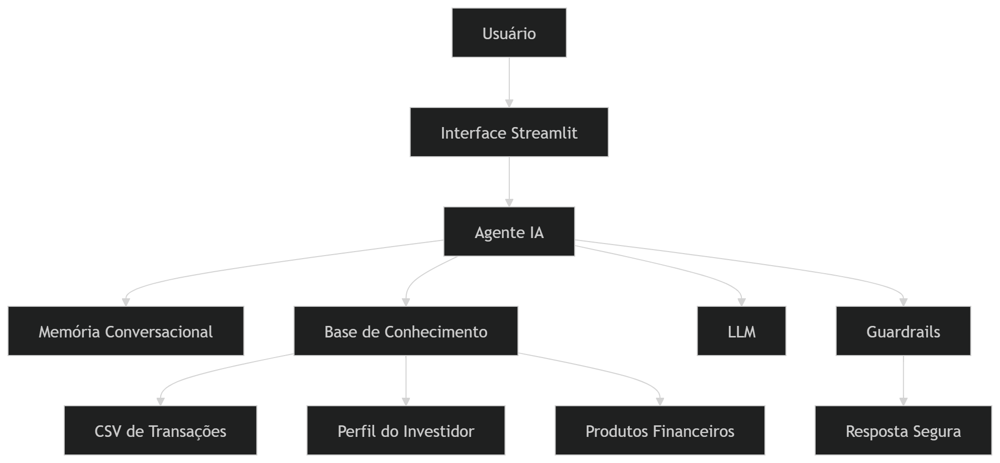

# FinGuide AI

Agente Financeiro Inteligente com IA Generativa.

## Objetivo

O FinGuide AI atua como um consultor financeiro pessoal inteligente, capaz de:

- antecipar problemas financeiros
- sugerir investimentos personalizados
- analisar comportamento financeiro
- gerar insights proativos
- oferecer recomendações seguras

---

---

# Funcionalidades

## Inteligência Financeira

- análise de gastos
- detecção de anomalias
- previsão de fluxo de caixa
- monitoramento financeiro

## IA Generativa

- atendimento conversacional
- geração de recomendações
- memória contextual
- respostas personalizadas

## Segurança

- anti-alucinação
- validação de respostas
- recomendações compatíveis com perfil

---

# Tecnologias

| Tecnologia | Uso |
|---|---|
| Python | Backend |
| Streamlit | Interface |
| LangChain | Orquestração |
| OpenAI GPT | IA Generativa |
| FAISS | Busca vetorial |
| Pandas | Processamento de dados |
| Docker | Containerização |

---

# Instalação

```bash
git clone https://github.com/seuusuario/agente-financeiro-ia.git

cd agente-financeiro-ia


pip install -r requirements.txt


cp .env.example .env


---

# Execucação

```bash
streamlit run src/app.py

